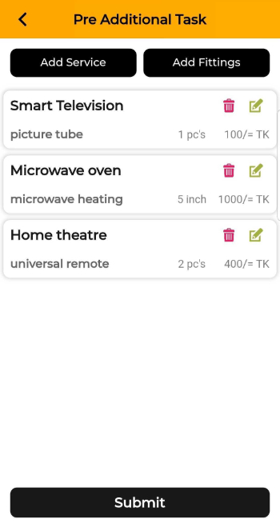

# mechanix

In this application I have used flutter as Mobile-end development and Node.js (Nest js) as server side back-end api development.

## Some Screenshot 

#### On Demand Schedule Page

#### Previous Schedule Page

#### Schedule history Page

#### Profile Page

#### Edit Profile Page

#### Pre Inspection Page

#### Add Service Page

#### Service List Page

#### Servicing Summary Page

#### Rating Page

#### About Us Page

